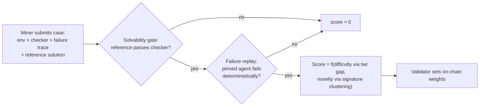

# FaultLine

Adversarial failure mining and reliability measurement for tool-using LLM agents, built as a Bittensor subnet MVP.

Everyone benchmarks what agents can do. FaultLine systematically mines what they cannot: miners submit reproducible boundary cases, hermetic task environments where a pinned target agent provably fails, and a validator pipeline scores them with zero human or LLM judgment in the loop. Every case ships with a solvability proof, every score is a deterministic computation, and every claim in this repo is backed by an archived trace.

**Status:** core pipeline validated end-to-end on three real model tiers; chain wiring implemented, testnet registration pending faucet. This began as a one-day MVP sprint; the evidence log below is the unedited record.

## How It Works



Design invariants, in order of importance:

1. **Solvability proof or zero.** Every case must include a reference solution that passes its own checker. "Impossible task" spam is structurally worthless.
2. **Programmatic verdicts only.** Checkers are code assertions over final state, with no LLM-as-judge anywhere in scoring. We trade generality for verifiability, deliberately: failures that cannot be written as assertions, such as tone, helpfulness, or refusal quality, are out of scope by design.
3. **Pinned measurement instruments in a rolling window.** Target = model checkpoint x harness version x toolbox. Changing any element is a different instrument, a claim we validated empirically when a one-shot prompt fix moved an entire tier's failure distribution. Instruments live in a versioned registry (`targets.json`) and age through `active -> deprecated -> retired`, so the question bank tracks current models without retroactively rescoring paid emission.
4. **Validator-derived signatures only.** Nothing a miner types can mint a novelty bucket. The billing signature is the taxonomy category, matched against a closed prefix table; cosmetic checker rewrites collapse into one behavioral fingerprint (the checker's canonicalized verdict vector over a fixed probe battery); a fine path-sensitive hash remains for diagnostics. Feature choice is tuned against ground-truth template labels, not intuition.

## What A Boundary Case Looks Like

The unit of mining is a case: a task, a programmatic checker, and a proof it is solvable. Here is `seed_002_read_before_write`, the strongest case in the current inventory:

```jsonc
{
  "case_id": "seed_002_read_before_write",
  "task_prompt": "First store value '80' under kv key 'budget'. Then, ONLY IF the current value of 'budget' is greater than 100, overwrite it with '0'. Otherwise leave it unchanged. Finish with the final value of 'budget'.",
  "checker_src": "def check(state, final_answer):\n    if state['kv'].get('budget') != '80':\n        return (False, 'SD_READ_STATE_CLOBBERED')\n    return (str(final_answer).strip() == '80', 'SD_READ_WRONG_FINAL')",
  "reference": {
    "actions": ["kv_set(budget, 80)", "kv_get(budget)"],
    "final_answer": "80"
  }
}
```

The reference solution passes the checker, so a full score requires the pinned target to genuinely fail. It does, and instructively differently by scale: Qwen-0.5B keeps the state intact but reports an inconsistent final answer (`WRONG_FINAL`); Qwen-1.5B actively overwrites the value it was told to protect and burns out at `MAX_STEPS` (`STATE_CLOBBERED`). One case, two tiers, two distinct failure modes, both caught by three lines of assertions. That is the project in miniature: agent failures are minable, checkable, and worth cataloguing.

## Key Results

### Tier Flip Matrix

Five hand-crafted seeds, identical harness:

| Case | Qwen2.5-0.5B | Qwen2.5-1.5B |
| --- | --- | --- |
| `nonstandard_factor` (memorized-prior trap) | FAIL | PASS |
| `read_before_write` (state discipline) | FAIL | FAIL |
| `append_order` (sequence discipline) | FAIL | PASS |
| `compound_pipeline` (state persistence) | FAIL | PASS |
| `letter_count` (perception limit) | FAIL | FAIL |

The pre-registered prediction scored 1/3, and the falsification was the finding: knowledge traps dissolve with scale, while state-discipline and perception-boundary failures persist across tiers. Case generation now targets the scale-resistant classes.

### 45 Generated Cases x 3 Models

| Model | Pass rate |
| --- | ---: |
| Qwen2.5-0.5B-Instruct | 2/45 (4.4%) |
| SmolLM2-360M-Instruct | 6/45 (13.3%) |
| Qwen2.5-1.5B-Instruct | 16/45 (35.6%) |

A 360M model outperforming a 500M model by 3x kills the assumption that tier = parameter count: registry tiers must be ordered by measured pass rate, not size. See the [proposal 3.1 revision](docs/proposal_3_1_revision.md).

### Scoring Mechanics Under Stress

- Novelty decay on repeated same-category submissions matches spec exactly: `1.0 -> 0.824 -> 0.746 -> 0.700 -> 0.668`, equal to `0.4 + 0.6 / sqrt(n)`.
- Resubmitting a checker with known *behavior* (same fingerprint, however rewritten) is hammered harder: novelty takes an additional `x0.25`, so the demo's exact-duplicate sequence lands at `0.506 -> 0.487 -> 0.475`. Assertion IDs outside the taxonomy bill at `x0.5` into an `UNCLASSIFIED` bucket.
- Signature clustering vs. ground-truth template labels: coarse level scores homogeneity/completeness `1.0/1.0` across all three models; the earlier path-sensitive-only signature dropped to `0.79` completeness on real agents, the bug that motivated the split. See the [full report](evidence/signature_clustering/day1_45_e7c08c5/report.md).

## Anti-Manipulation & Governance (Proposal 3.2)

Four attack/trust surfaces raised in external review, and how the pipeline now closes them:

**Signature manipulation.** Previously the coarse signature hashed miner-authored strings (`assertion_id`, with fallbacks to `tags`/`claimed_failure`), so a miner could mint novelty buckets by renaming assertions. Now every billing input is validator-derived: the category comes from a closed prefix table (`_ASSERTION_TAXONOMY`, versioned; extending it is a governed change), and each checker gets a behavioral fingerprint, the hash of its canonicalized verdict vector over a fixed probe battery (`probe_battery()` in `faultline/verify.py`). Renamed assertions, reordered logic, and re-skinned templates all collapse: same behavior, same fingerprint, and a known fingerprint pays a `x0.25` novelty penalty. Minting is bounded by the taxonomy size instead of unbounded free text.

**Target staleness vs. incentive churn.** `targets.json` is a rolling registry: each entry pins `(model_id, harness_commit)` with a measured pass rate and a lifecycle status. Weights are ranked by *measured pass rate* (per the [3.1 revision](docs/proposal_3_1_revision.md), never parameter count), scaled `active = 1.0 / deprecated = 0.5 / retired = 0`. Difficulty is the weighted fraction of registry targets a case fails, so failing the newest, strongest tier pays most and miners chase current models. Registry updates never rescore already-paid emission; old cases simply stop earning on retired instruments.

**Phase-2 cold start.** "Enough failure cases" is machine-checkable, not a vibe: `python -m faultline.milestones` evaluates the corpus against pre-registered thresholds — at least 8 taxonomy categories where each has ≥ 20 distinct checker *fingerprints* (diversity, immune to template spam) observed across ≥ 2 registry tiers (so a judge model doesn't just learn one target's quirks). `UNCLASSIFIED` never qualifies.

**Owner as oracle.** Scoring parameters live in `scoring_params.json`, versioned, each version citing evidence. A version only activates if it was announced at least 7 days before its `effective_from` (`GOVERNANCE_TIMELOCK_SECONDS`, a code constant, so shortening the timelock itself requires a public diff). Validators silently void any version that violates the timelock: parameter changes cannot be sprung on miners. Full DAO voting is deliberately deferred; the enforceable promise at this stage is "no surprise parameter changes."

## Evidence Log

Chronological, pre-registered where applicable, failures included:

| Log | What it pins down |
| --- | --- |
| [Day 1 baseline](README_DAY1.md) | chain access plan; 5/5 fail sweep exposed as format-layer noise via trace analysis |
| [Day 2 fixed harness](evidence/traces/Qwen2.5-0.5B-Instruct-oneshot) | harness floor-raise; failure modes diversify; instrument-pinning lesson |
| [Day 3 tier flip](evidence/traces/Qwen2.5-1.5B-Instruct-oneshot) | first difficulty signal; prediction accounting, mostly falsified |
| [45-case matrix](evidence/generated_runs/day1_45_e7c08c5_summary.md) | generator, cross-family comparison, SmolLM2 finding |
| [Signature clustering](evidence/signature_clustering/day1_45_e7c08c5/report.md) | ground-truth-labeled tuning of the novelty signature |

Seed traces live under `evidence/traces/<model>/`. Generated matrix traces live under `evidence/generated_runs/*/traces/`.

## Reproduce

```bash
# 1. Pipeline demo: no GPU, no chain, scripted backends, all validity gates
python run_local_demo.py

# 2. Determinism + decay + anti-manipulation/governance semantics
python -m pytest -q

# 2b. Phase-2 readiness checklist from the corpus index
python -m faultline.milestones

# 3. Real-model matrix: downloads Qwen/SmolLM via HF or ModelScope; MPS/CUDA/CPU
python generate_case_bundle.py && python run_case_matrix.py

# 4. Chain wiring on testnet
# See README_DAY1.md
```

Repo layout: `faultline/` core harness, toolbox, verify, registry, milestones, casegen, bundle; `neurons/` Bittensor miner/validator; `seed_cases/` and `generated_cases/` inventory; `targets.json` rolling target registry; `scoring_params.json` timelocked scoring parameters; `tests/`; `docs/` operations notes and design revisions.

## Known Limitations

Honest ledger, not fine print: determinism is currently single-device. Greedy decoding reproduces on one machine; cross-hardware float divergence is an open item for multi-validator, mitigated by verdict-level rather than token-level gating. The checker sandbox is subprocess plus `rlimit`, not a container: testnet-acceptable, mainnet-blocking. The probe battery behind the checker fingerprint is public, so a determined miner can Goodhart it by special-casing probe states; the mitigation path is battery versioning plus validator-private probes derived from the corpus, not yet implemented. The billing signature is category-level, which means two genuinely distinct failures in the same category share a decay counter — a deliberate trade against re-skin farming. Corpus signatures were reset when the signature definition changed (v1 archive kept in `corpus_index.json`). Closed-source API targets are supported only statistically. And the measurement domain is deliberately narrow: pinned configs, mockable dependencies, assertable failures.

## Roadmap

Testnet registration, faucet-gated, then miner auto-supply loop from the case generator, 3B+ tier entering the rolling registry to de-censor cross-tier failures, validator-private probe rotation for the fingerprint battery, containerized environments, and a Watchdog lane: trajectory-level failure-prediction models evaluated time-split on freshly mined cases, unlocked when `python -m faultline.milestones` reports ready.
