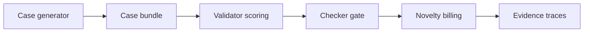

# FaultLine

Status: pending faucet/testnet deployment.

FaultLine is a Bittensor testnet MVP for scoring adversarial case submissions against pinned agent harnesses. The current evidence chain is pinned in git:

- `e7c08c5` baseline harness and seed evidence
- `3352143` generated 45-case matrix and novelty stress
- `ea60e72` two-level novelty/diagnostic signatures



## Evidence

- [Day-1 run summary](evidence/generated_runs/day1_45_e7c08c5_summary.md)
- [Generated cases](generated_cases/day1_45/manifest.json)
- [Qwen model matrix](evidence/generated_runs/day1_45_e7c08c5_qwen_0p5_1p5/summary.csv)
- [SmolLM2 model matrix](evidence/generated_runs/day1_45_e7c08c5_smollm360/summary.csv)
- [Signature clustering report](evidence/signature_clustering/day1_45_e7c08c5/report.md)
- [Proposal 3.1 revision notes](docs/proposal_3_1_revision.md)

## Local Verification

```bash
bt_env/bin/python run_local_demo.py
bt_env/bin/python -m pytest -q
```

## Testnet Runbook

See [README_DAY1.md](README_DAY1.md).
